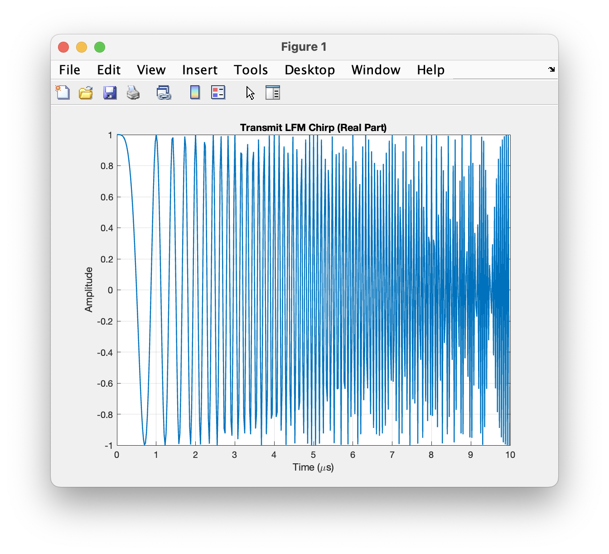
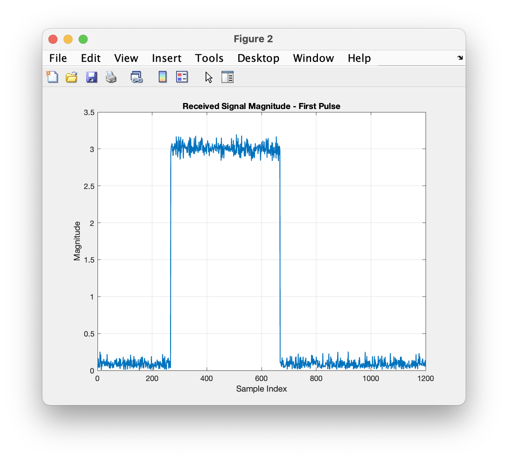
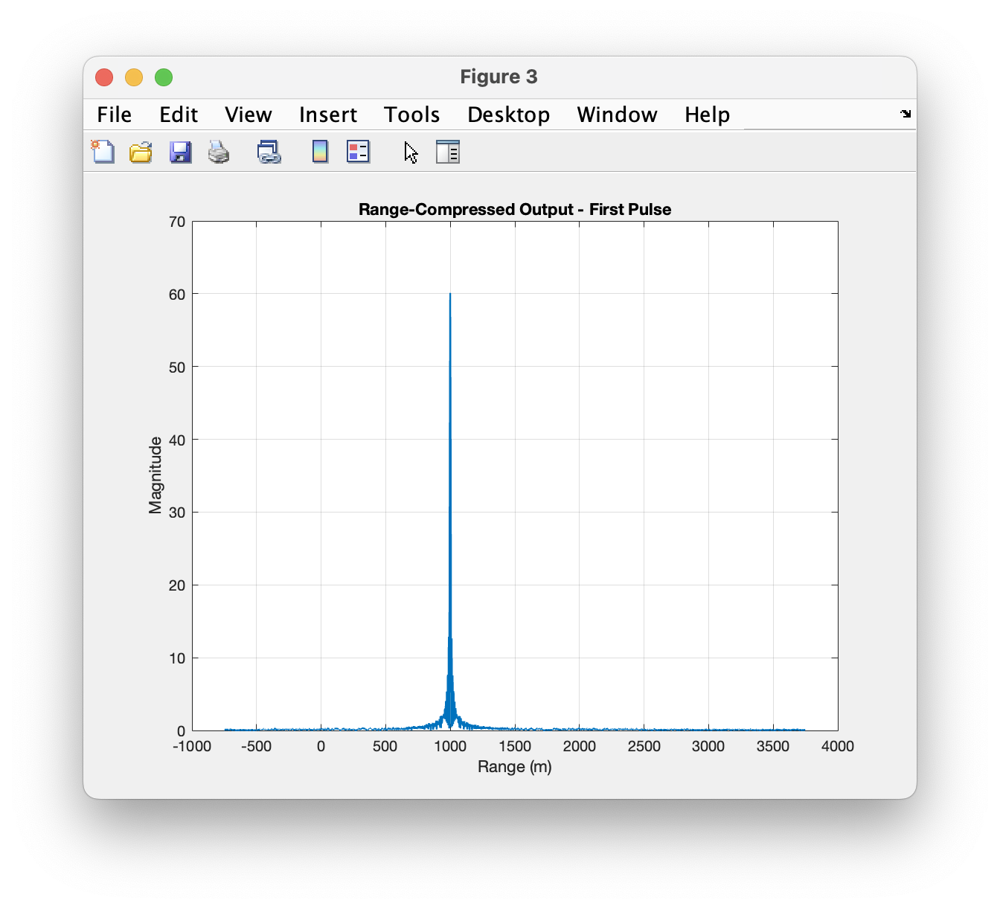
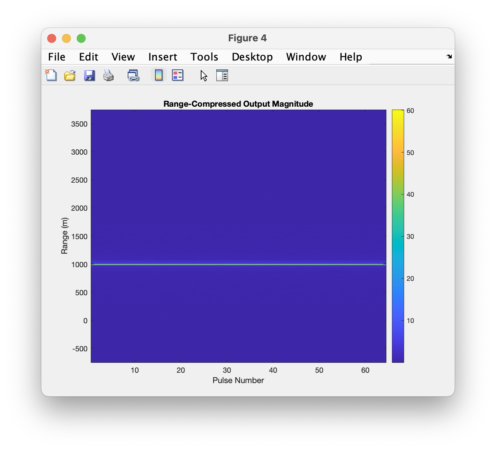
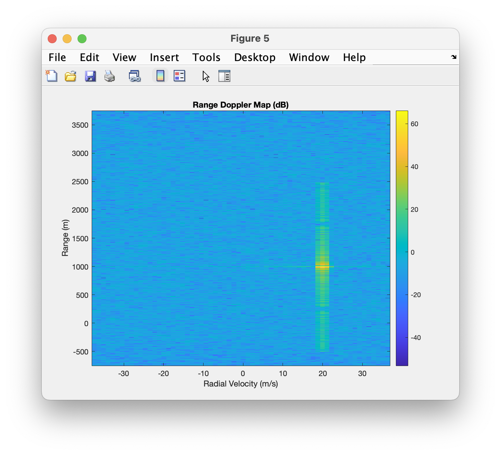
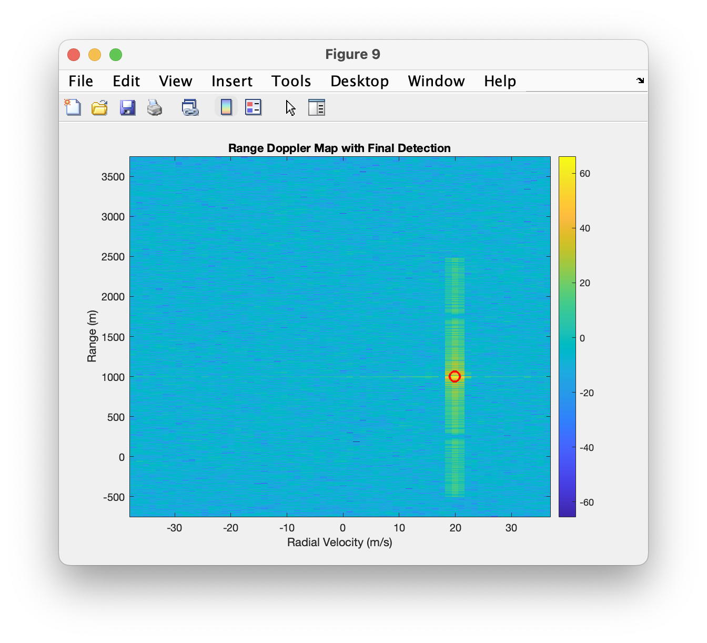

# Pulse-Doppler-Single-Target
MATLAB simulation of a pulse Doppler radar with constant false alarm rate detection

# Objectives
- Simulate a single target pulse Doppler radar return signal
- Generate and process a linear frequency modulated chirp
- Perform matched filter range compression
- Generate a range Doppler map
- Detect the target with 2 dimensional cell averaging constant false alarm rate
- Isolate the final estimate using peak filtering and strongest detection

# Processing
1. LFM chirp generation
2. Single moving target echo simulation
3. Matched filter range compression
4. Doppler fast fourier transform across pulses
5. Range Doppler map generation
6. Doppler windowing with Hamming window
7. 2D CFAR
8. Local peak filtering
9. Final strongest target selection

# Files
- 'main.m' - runs the simulation and plotting
- 'generate_chirp.m' - generates the complex baseband LFM chirp
- 'simulate_single_target.m' - simulates a delayed moving target echo over multiple pulses
- 'range_compress.m' - does matched filter range compression
- 'doppler_process.m' - performs Doppler fft processing and builds the range Doppler map
- 'cfar_2d.m' - performs 2D cell averaging cfar detection
- 'peak_filter_2d.m' = filters detections to local 2D maxima

# Radar params
- Carrier frequency: 10 GHz
- Chirp bandwidth: 20MHz
- Pulse width: 10µs
- Receive window: 30 µs
- Sampling rate: 40 MHz
- Pulse repetition frequency: 5 kHz
- Number of pulses: 64

# Target params
- Initial range: 1000 m
- Initial velocity: 20 m/s

# Result
Successful detection of the target at:
- Range ≈ 1000 m
- Radial velocity ≈ 20 m/s

# Figures







# How to Run
1. Open the project folder in MATLAB
2. Make sure all `.m` files are in the same directory
3. Run:

```matlab
main
